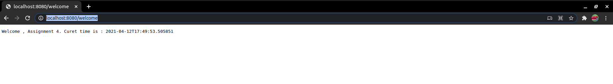
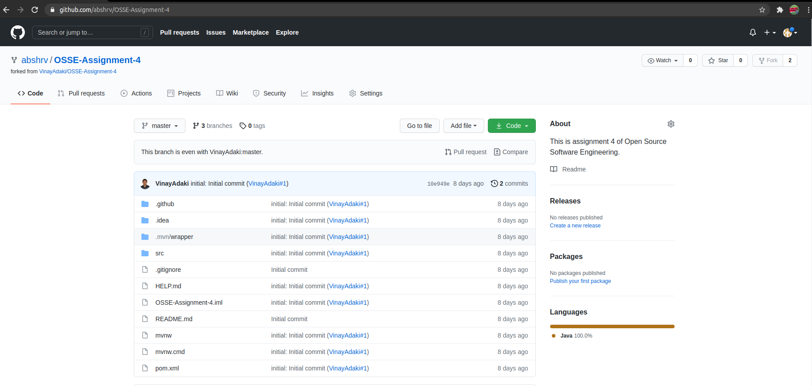
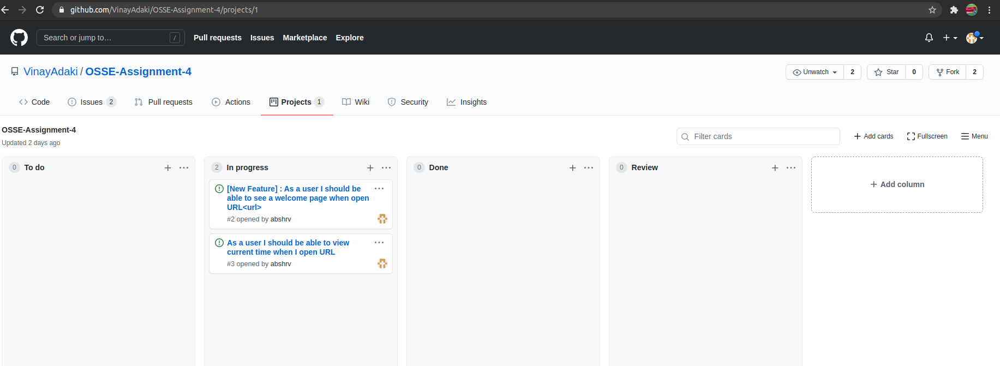
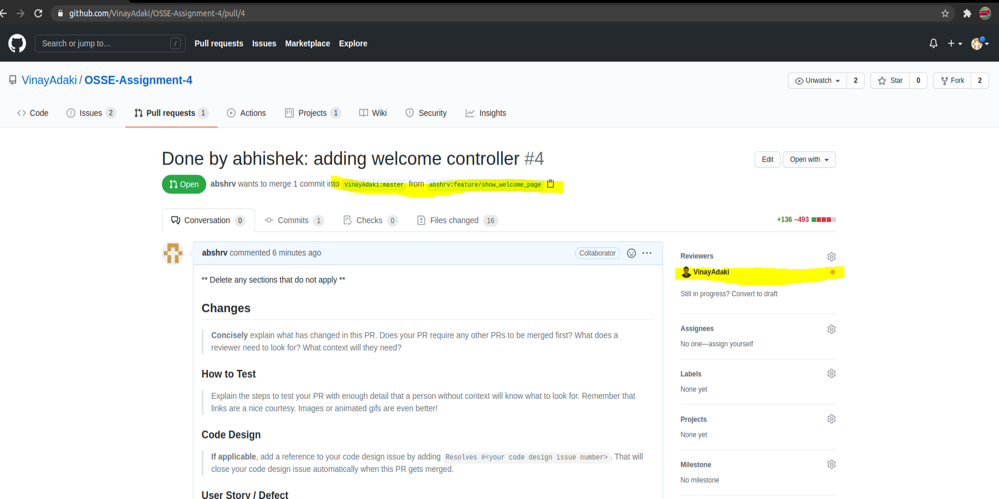
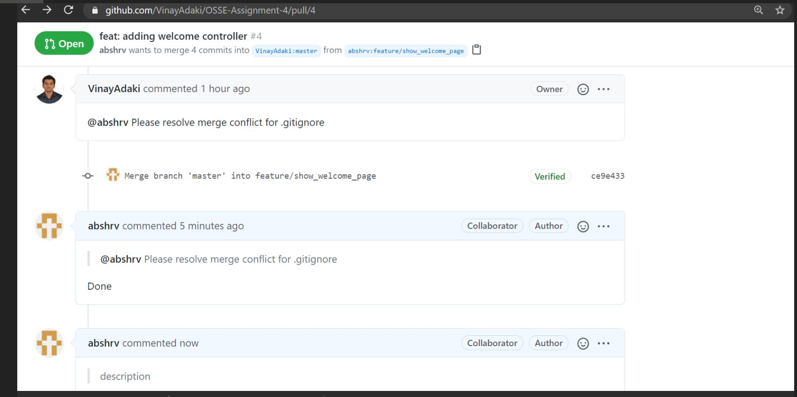

# OSSE-Assignment-4
This is assignment 4 of Open Source Software Engineering.

## Changes done by Abhishek : Start

Ide used to make project : Eclipse
Technology used to make Controller : SpringBoot (https://spring.io/projects/spring-boot)

Step followed

 * Created fork
 * Create new branch ( locally)
 * work on new branch ( change code base)
 * push to remote branch
 * create a PR assign it to Vinay Adaki
 
 * GIt command used
 
 git clone https://github.com/abshrv/OSSE-Assignment-4.git  
 git branch feature/show_welcome_page master  
 git push -u origin feature/show_welcome_pag  
 git status  
 git checkout feature/show_welcome_page  
 git add .  
 git commit -m "added welcome container"  
 git push  

## Changes done by Abhishek : End

**Changes done by Aby : Start**

IDE used to make project : Eclipse

**Step followed**

    1. Created fork

    2. Create new branch ( locally)

    3. Work on new branch ( change code base)

    4. Push to remote branch

    5. Create a PR and assign it to Vinay Adaki

**Git Commands Used**

git clone https://github.com/abshrv/OSSE-Assignment-4.git git branch feature/show_welcome_page master git push -u origin feature/show_welcome_pag git status git checkout feature/show_welcome_page git add . git commit -m "added welcome container" git push

welcome Aby_form aby_project_board aby_pr

**Changes done by Aby : End**
